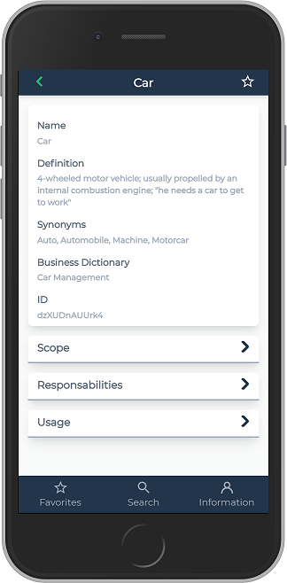
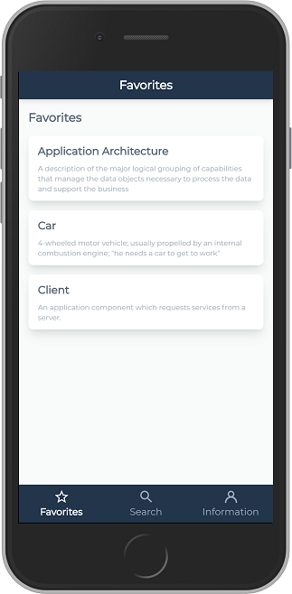

# Data ID Card

**Data ID Card** is a mobile application. It allows you to consult your Data Asset inventories anywhere and on any device.

Using Data ID Card it is possible to:

- Look for a Data defined in the Business Glossary by searching a chain of character in its term name in the current language and consult its main characteristics.
- Navigate from an application to technologies it is using or from a technology to applications using it.
- Declare a business Data as a favorite to accelerate frequent consultation.

## Installation procedure

- [Install and configure from **data-idcard.zip**](docs/deployment.md)
- [Configure build and deploy](docs/configure-build-deploy.md)

## Documentation

- [Data ID Card quick start guide](docs/readme.md)

## Licence
- [Licence](LICENSE)
