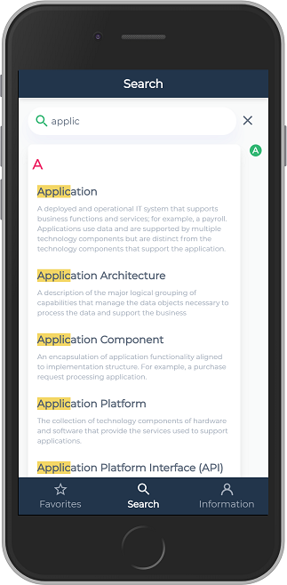
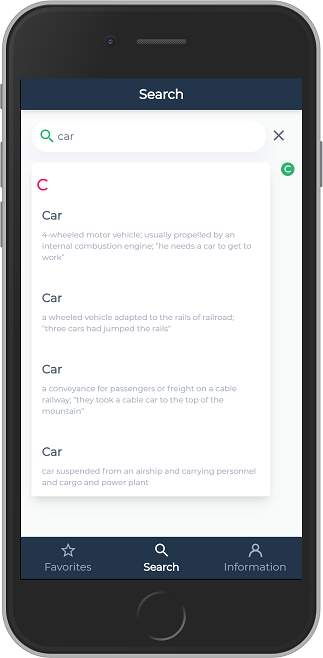
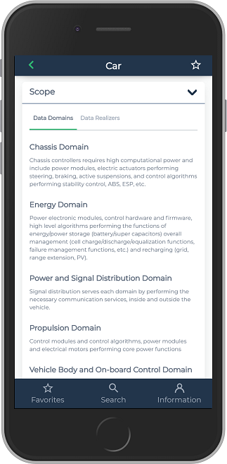
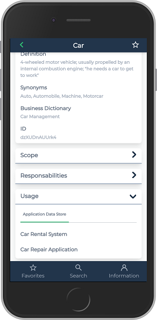

# Data ID Card Quick Start Guide

**Data ID Card** is a mobile component of HOPEX Information Architecture. It enables anyone to consult Data Asset inventory in a HOPEX repository.
Data Id Card allows you to search the data from the names of the terms in the business dictionaries of the repository. This provides access to the business data which defines the term, its characteristics, its responsibles, its functional scope, its realization and their uses in application assets invetories.

 

## Sign In

After the [Installation of Data ID Card], open **Data ID Card** App or, with Google Chrome (for instance), browse to the **Data ID Card** URL. The following login page opens.

Enter your **Username** and **Password** (the same as when in **HOPEX IA**) then tab **Sign In**. The Search page opens.

## Search

Search page presents one tab to select which Term defined by Data asset you want to look for.

To search for a Data, start typing some characters in the search field. Those characters will be searched in the name of all defined terms of the repository in the current language.

If you have already made some searches, the page presents the list of the last 15 consulted items.

Selecting a Business Data in the result list will open Data ID Card with different sections:
- Business Data Main Characteristics
- Scope
- Responsibility
- Usage

## Favorite Management

On a Data page, clicking on the star will declare/remove current page as favorite. All favorites can be quickly retrieved in the favorites page.

 
## Information Menu

This menu allows user to:
- Change the data language, which is used for display and search.
- Display field label even if data is missing
- Sign out

## Install Data ID Card

[Installation compatibility chart](https://caniuse.com/#feat=serviceworkers)

### Safari on IOS

To put **Data ID Card** as a shortcut on your Home screen, do the following:

1.	Browse to **Data ID Card** URL in Safari
1.	Tap the **Share button** in Safari.
1.	Tap the icon labeled **Add to Home Screen**.
1.	Tap Add in the upper-right corner.
1.	Now name **Data ID Card** so that it's distinguishable from its native counterpart on the Home screen and in Search
1.	Tap Add in the upper-right corner.

### Samsung Internet

1.	Browse to **Data ID Card** URL in Samsung Internet
1.	Then :
	- On the the address bar 
		- Tap on the **download sign**   
	- Or on the Samsung Internet menu 
	1.	Tap on **+ Add page to**
	1.	Select **Apps Screen** on the popup window
1.	Confirm your choice in the popup window by selecting Install

### Chrome on Android

1.	Browse to Data ID Card URL in chrome.
1.	Then:
	- Tap on the message
		- **Add Data ID Card to Home screen**
	- or select in chrome menu 
		- **Add to Home screen** in chrome menu
1.	Confirm your choice in the popup window by selecting Add.

## Reset cache

### Reset cache in chrome

1.	Select **Settings** in chrome menu.
1.	Under Select **Site Settings** under advanced section.
1.	Select Storage
1.	Select the storage corresponding to app ID Card web site.
1.	Tap on **Clear & Reset**

## Reset cache in Samsung Internet

1.	Select **Settings** in the menu.
1.	Tap on **Sites and Download**
1.	Tap on **Manage website data**
1.	Tap on **Delete**
